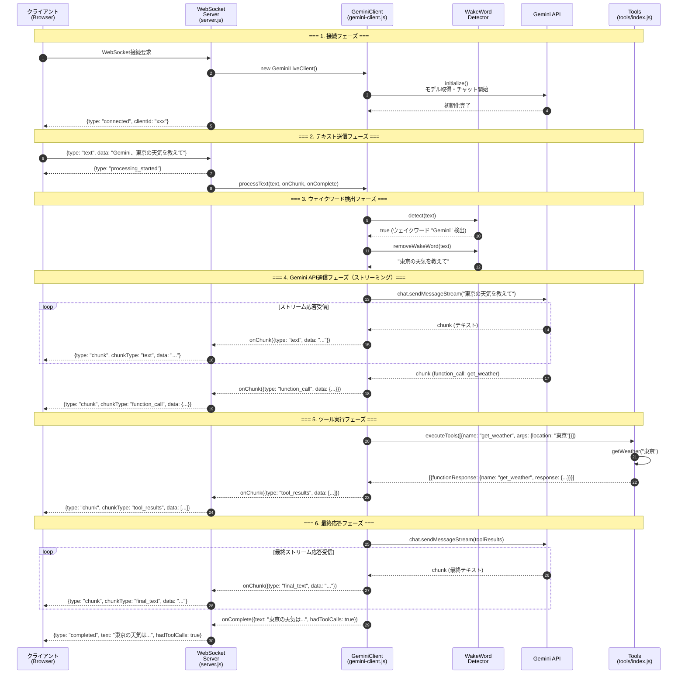
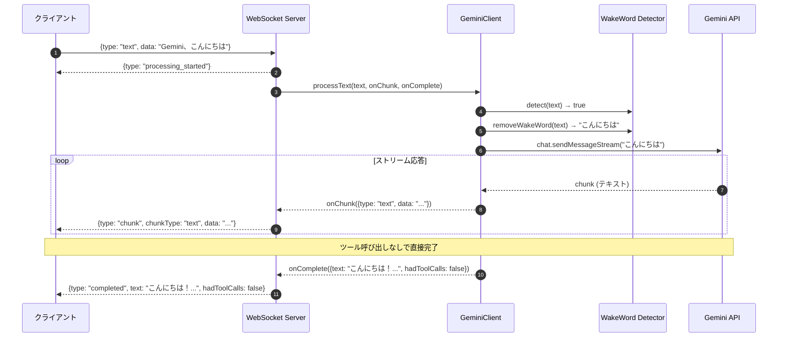
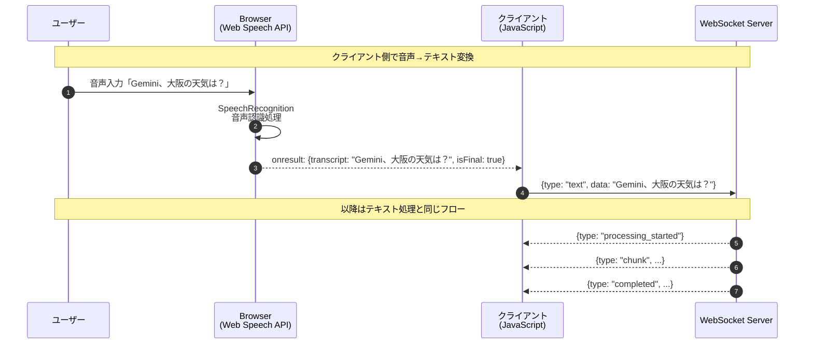
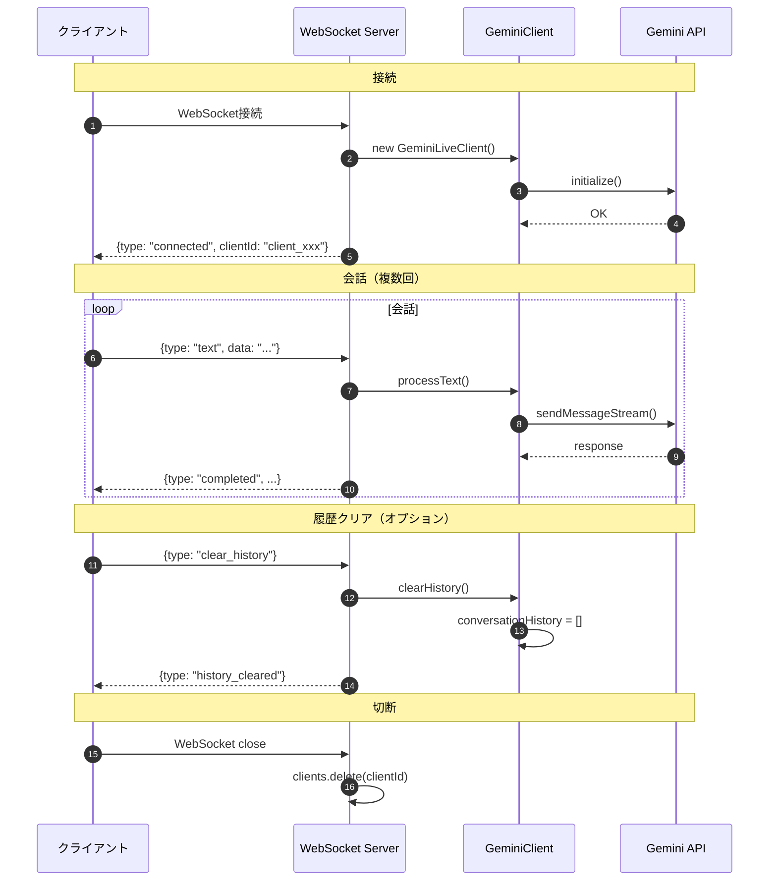

# 音声認識サーバ (Gemini Live API)

Gemini Live APIを使用した音声認識WebSocketサーバです。ウェイクワード検知、ツール実行（天気情報取得）、音声+テキスト応答に対応しています。

## 目次

- [概要](#概要)
- [処理フロー](#処理フロー)
- [シーケンス図](#シーケンス図)
- [アーキテクチャ](#アーキテクチャ)
- [ファイル構成と各コンポーネントの役割](#ファイル構成と各コンポーネントの役割)
- [セットアップ](#セットアップ)
- [使い方](#使い方)
- [メッセージプロトコル](#メッセージプロトコル)

---

## 概要

このサーバは、クライアントからのテキスト/音声入力を受け取り、Google の Gemini API を使って処理し、結果をストリーミングで返却します。

### 主な機能

- WebSocketベースのリアルタイム通信
- カスタムウェイクワード検知（gemini、ジェミニ、hey gemini）
- ツール実行（Function Calling）- 天気情報取得
- ストリーミングレスポンス
- チャット履歴管理

---

## 処理フロー

### 全体の流れ

```
1. クライアント処理（Browser）
   └─ ユーザー入力（テキスト or 音声）
   └─ 音声の場合: Web Speech API でテキスト変換
   └─ WebSocket でサーバに送信

2. サーバへのメッセージ送信
   └─ JSON形式: { type: "text", data: "Gemini、東京の天気を教えて" }

3. サーバでの処理
   └─ WebSocketサーバがメッセージ受信
   └─ ウェイクワード検出 → 除去
   └─ Gemini API へストリーミング送信
   └─ ツール呼び出しがあれば実行
   └─ 結果をストリーミングで返却

4. フロントへの返却
   └─ チャンクごとに { type: "chunk", data: "..." } を送信
   └─ 完了時に { type: "completed", text: "..." } を送信
```

### 詳細な処理ステップ

| ステップ | 処理場所 | 処理内容 |
|---------|---------|---------|
| 1 | クライアント | ユーザーがテキスト入力 or 音声入力 |
| 2 | クライアント | 音声入力の場合、Web Speech API でテキスト変換 |
| 3 | クライアント | WebSocket で `{type: "text", data: "..."}` を送信 |
| 4 | server.js | メッセージを受信、`handleTextMessage()` を呼び出し |
| 5 | server.js | `processing_started` をクライアントに通知 |
| 6 | gemini-client.js | `processText()` でウェイクワード検出 |
| 7 | wake-word-detector.js | テキストからウェイクワードを検出・除去 |
| 8 | gemini-client.js | Gemini API に `sendMessageStream()` で送信 |
| 9 | gemini-client.js | ストリーム応答を受信、チャンクごとにコールバック |
| 10 | server.js | チャンクを `{type: "chunk", ...}` でクライアントに送信 |
| 11 | tools/index.js | `function_call` があればツールを実行 |
| 12 | gemini-client.js | ツール結果を Gemini API に送信、最終応答を取得 |
| 13 | server.js | `{type: "completed", ...}` でクライアントに完了通知 |

---

## シーケンス図

### テキストメッセージの処理フロー（ツール呼び出しあり）



### テキストメッセージの処理フロー（ツール呼び出しなし）



### 音声入力の処理フロー



### 接続〜切断のライフサイクル



---

## アーキテクチャ

```
┌─────────────────────────────────────────────────────────────────────────┐
│                           クライアント側                                  │
│  ┌──────────────────┐    ┌──────────────────┐    ┌──────────────────┐  │
│  │   Web Speech API  │    │   テキスト入力    │    │    UI 表示       │  │
│  │   (音声→テキスト) │    │                  │    │                  │  │
│  └────────┬─────────┘    └────────┬─────────┘    └────────▲─────────┘  │
│           │                       │                       │            │
│           └───────────┬───────────┘                       │            │
│                       ▼                                   │            │
│              ┌────────────────┐                           │            │
│              │   WebSocket    │◄──────────────────────────┘            │
│              │   クライアント  │                                        │
│              └────────┬───────┘                                        │
└───────────────────────┼────────────────────────────────────────────────┘
                        │ WebSocket (ws://localhost:8080)
                        ▼
┌───────────────────────────────────────────────────────────────────────┐
│                           サーバ側                                     │
│  ┌────────────────────────────────────────────────────────────────┐  │
│  │                        server.js                                │  │
│  │  ┌──────────────┐  ┌──────────────┐  ┌──────────────────────┐  │  │
│  │  │  WebSocket   │  │   クライアント │  │   メッセージ         │  │  │
│  │  │   Server     │─▶│   管理        │─▶│   ルーティング       │  │  │
│  │  └──────────────┘  └──────────────┘  └──────────┬───────────┘  │  │
│  └─────────────────────────────────────────────────┼───────────────┘  │
│                                                    ▼                  │
│  ┌────────────────────────────────────────────────────────────────┐  │
│  │                     gemini-client.js                            │  │
│  │  ┌──────────────┐  ┌──────────────┐  ┌──────────────────────┐  │  │
│  │  │ WakeWord     │─▶│  Gemini API  │─▶│  ストリーミング      │  │  │
│  │  │ Detector     │  │  チャット     │  │   レスポンス処理     │  │  │
│  │  └──────────────┘  └──────────────┘  └──────────┬───────────┘  │  │
│  └─────────────────────────────────────────────────┼───────────────┘  │
│                                                    ▼                  │
│  ┌────────────────────────────────────────────────────────────────┐  │
│  │                       tools/index.js                            │  │
│  │  ┌──────────────┐  ┌──────────────┐  ┌──────────────────────┐  │  │
│  │  │  get_weather │  │ get_forecast │  │  get_weather_alerts  │  │  │
│  │  └──────────────┘  └──────────────┘  └──────────────────────┘  │  │
│  └────────────────────────────────────────────────────────────────┘  │
└───────────────────────────────────────────────────────────────────────┘
```

---

## ファイル構成と各コンポーネントの役割

```
voice-recognition-server/
├── src/
│   ├── server.js              # メインWebSocketサーバ
│   ├── gemini-client.js       # Gemini Live APIクライアント
│   ├── audio-processor.js     # 音声処理・バッファリング
│   ├── wake-word-detector.js  # ウェイクワード検知
│   ├── config.js              # 設定ファイル
│   └── tools/
│       ├── index.js           # ツール定義・実行マネージャー
│       └── weather.js         # 天気情報取得ツール
├── client/
│   └── test-client.html       # テスト用Webクライアント
├── package.json
└── README.md
```

### 各ファイルの役割

| ファイル | 役割 | 主な関数/クラス |
|---------|------|----------------|
| `server.js` | WebSocketサーバ本体。接続管理、メッセージルーティング | `handleTextMessage()`, `handleAudioMessage()` |
| `gemini-client.js` | Gemini APIとの通信、ストリーミング処理 | `GeminiLiveClient`, `processText()`, `initialize()` |
| `wake-word-detector.js` | ウェイクワード検出・除去 | `WakeWordDetector`, `detect()`, `removeWakeWord()` |
| `audio-processor.js` | 音声データのバッファリング（現在は限定的使用） | `AudioProcessor`, `addAudioData()` |
| `config.js` | 設定値の一元管理 | `config`, `validateConfig()` |
| `tools/index.js` | ツール定義とディスパッチ | `getToolDefinitions()`, `executeTool()`, `executeTools()` |
| `tools/weather.js` | 天気情報取得（シミュレーション） | `getWeather()`, `getForecast()`, `getWeatherAlerts()` |
| `test-client.html` | ブラウザ用テストクライアント | WebSocket接続、Web Speech API、UI |

---

## メッセージプロトコル

### クライアント → サーバ

| type | 説明 | データ例 |
|------|------|---------|
| `text` | テキストメッセージ送信 | `{type: "text", data: "Gemini、東京の天気を教えて"}` |
| `audio` | 音声データ送信（非推奨） | `{type: "audio", data: "<base64>"}` |
| `clear_history` | 会話履歴クリア | `{type: "clear_history"}` |
| `get_stats` | 統計情報取得 | `{type: "get_stats"}` |

### サーバ → クライアント

| type | 説明 | データ例 |
|------|------|---------|
| `connected` | 接続成功 | `{type: "connected", clientId: "xxx", config: {...}}` |
| `processing_started` | 処理開始 | `{type: "processing_started"}` |
| `chunk` | ストリーミングチャンク | `{type: "chunk", chunkType: "text", data: "..."}` |
| `completed` | 処理完了 | `{type: "completed", text: "...", hadToolCalls: true}` |
| `error` | エラー | `{type: "error", message: "...", error: "..."}` |
| `history_cleared` | 履歴クリア完了 | `{type: "history_cleared"}` |
| `stats` | 統計情報 | `{type: "stats", data: {...}}` |

### chunkType の種類

| chunkType | 説明 |
|-----------|------|
| `text` | Geminiからのテキスト応答（初回） |
| `function_call` | ツール呼び出し要求 |
| `tool_results` | ツール実行結果 |
| `final_text` | ツール実行後の最終テキスト応答 |

---

## セットアップ

### 1. 依存パッケージのインストール

```bash
cd voice-recognition-server
npm install
```

### 2. 環境変数の設定

```bash
export GEMINI_API_KEY=your_api_key_here
```

または `.env` ファイルを作成:

```env
GEMINI_API_KEY=your_api_key_here
PORT=8080
HOST=0.0.0.0
```

### 3. サーバ起動

```bash
# 開発モード（ファイル変更時に自動再起動）
npm run dev

# 本番モード
npm start
```

---

## 使い方

### テストクライアントを使用

1. サーバを起動: `npm run dev`
2. ブラウザで `client/test-client.html` を開く
3. 「接続」ボタンをクリック
4. テキスト入力にウェイクワードを含むメッセージを入力して送信
   - 例: "Gemini、東京の天気を教えて"
5. または「音声認識開始」ボタンで音声入力

### ウェイクワード

システムは以下のウェイクワードを検知します（大文字小文字を区別しない）:

- `gemini`
- `ジェミニ`
- `hey gemini`

### 利用可能なツール

| ツール | 説明 | 例 |
|-------|------|---|
| `get_weather` | 現在の天気を取得 | "Gemini、東京の天気を教えて" |
| `get_forecast` | 天気予報を取得 | "Gemini、大阪の3日間の天気予報を教えて" |
| `get_weather_alerts` | 天気アラートを取得 | "Gemini、東京に天気アラートはある？" |

---

## 技術スタック

- **Node.js**: v18以上
- **WebSocket**: `ws` パッケージ
- **Gemini API**: `@google/generative-ai` パッケージ
- **環境変数管理**: `dotenv`

## 制限事項

- 現在の`@google/generative-ai`パッケージは、音声ストリーミングを直接サポートしていません
- 音声入力は、クライアント側でWeb Speech APIを使用してテキストに変換する必要があります
- 天気情報はシミュレーションデータです（実際のAPIとは連携していません）

## ライセンス

MIT
