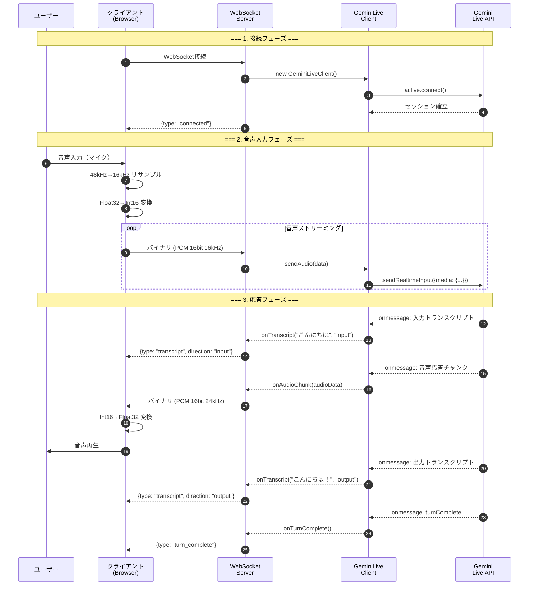
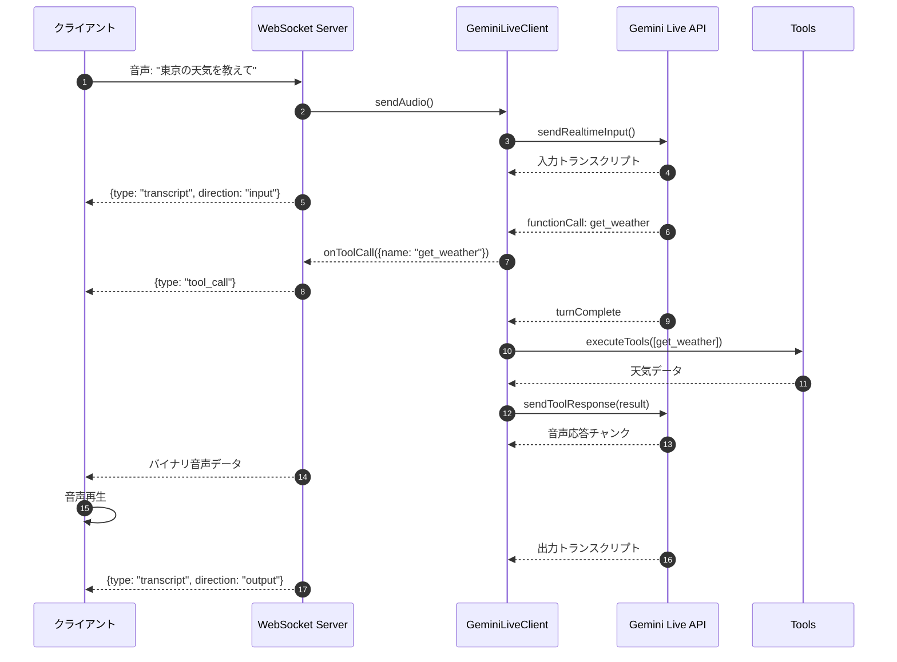

# 音声認識サーバ (Gemini Live API - 音声ストリーミング対応)

Gemini Live APIを使用した**双方向音声ストリーミング**サーバです。マイクからの音声をリアルタイムでGeminiに送信し、音声で応答を受け取ります。

## 目次

- [概要](#概要)
- [処理フロー](#処理フロー)
- [シーケンス図](#シーケンス図)
- [アーキテクチャ](#アーキテクチャ)
- [ファイル構成](#ファイル構成)
- [セットアップ](#セットアップ)
- [使い方](#使い方)
- [メッセージプロトコル](#メッセージプロトコル)

---

## 概要

このサーバは、クライアントからの**生の音声データ（PCM）**をリアルタイムでGemini Live APIに送信し、**音声で応答を返却**します。

### 主な機能

- 双方向音声ストリーミング（音声入力 → 音声出力）
- リアルタイム音声認識（トランスクリプト表示）
- ツール実行（Function Calling）
- 音声ビジュアライザー
- テキスト入力も対応

### 音声フォーマット

| 方向 | フォーマット | 詳細 |
|------|-------------|------|
| 入力（クライアント→Gemini） | PCM 16bit 16kHz mono | little-endian |
| 出力（Gemini→クライアント） | PCM 16bit 24kHz mono | little-endian |

---

## 処理フロー

### 全体の流れ

```
1. クライアント（Browser）
   └─ マイクから音声キャプチャ（48kHz）
   └─ 16kHz にダウンサンプリング
   └─ PCM 16bit に変換
   └─ WebSocket でバイナリ送信

2. サーバ（Node.js）
   └─ WebSocket でバイナリ受信
   └─ Gemini Live API に転送

3. Gemini Live API
   └─ 音声を認識
   └─ 応答を生成（ツール実行含む）
   └─ 音声で応答を返却

4. サーバ → クライアント
   └─ 音声データをバイナリで転送
   └─ トランスクリプトをJSON で送信

5. クライアント
   └─ PCM 24kHz を AudioContext で再生
   └─ トランスクリプトを画面表示
```

---

## シーケンス図

### 音声会話のフロー



### ツール実行を含むフロー



---

## アーキテクチャ

```
┌─────────────────────────────────────────────────────────────────────────┐
│                           クライアント (Browser)                         │
│                                                                         │
│  ┌───────────────┐    ┌───────────────┐    ┌───────────────────────┐  │
│  │   マイク入力   │    │  AudioWorklet  │    │   音声再生            │  │
│  │   (48kHz)     │───▶│  (リサンプル)   │    │   (24kHz)            │  │
│  └───────────────┘    │  48k→16kHz    │    └───────────▲───────────┘  │
│                       └───────┬───────┘                │              │
│                               │                        │              │
│                       ┌───────▼───────┐        ┌───────┴───────┐      │
│                       │  WebSocket    │◀───────│   音声キュー   │      │
│                       │  (Binary)     │        │               │      │
│                       └───────┬───────┘        └───────────────┘      │
└───────────────────────────────┼────────────────────────────────────────┘
                                │
                    WebSocket (ws://localhost:8080)
                    バイナリ: PCM音声データ
                    テキスト: JSONメッセージ
                                │
┌───────────────────────────────┼────────────────────────────────────────┐
│                           サーバ (Node.js)                              │
│                               │                                        │
│  ┌────────────────────────────▼────────────────────────────────────┐  │
│  │                        server.js                                 │  │
│  │  ┌──────────────┐  ┌──────────────┐  ┌──────────────────────┐   │  │
│  │  │  WebSocket   │  │  バイナリ/   │  │   コールバック       │   │  │
│  │  │   Server     │─▶│  JSON判定    │─▶│   ディスパッチ       │   │  │
│  │  └──────────────┘  └──────────────┘  └──────────┬───────────┘   │  │
│  └─────────────────────────────────────────────────┼────────────────┘  │
│                                                    │                   │
│  ┌─────────────────────────────────────────────────▼────────────────┐  │
│  │                   gemini-live-client.js                          │  │
│  │  ┌──────────────┐  ┌──────────────┐  ┌──────────────────────┐   │  │
│  │  │ sendAudio()  │  │ ai.live      │  │   コールバック       │   │  │
│  │  │ sendText()   │─▶│ .connect()   │─▶│   onAudioChunk      │   │  │
│  │  └──────────────┘  └──────────────┘  │   onTranscript      │   │  │
│  │                                       │   onToolCall        │   │  │
│  │                                       └──────────┬───────────┘   │  │
│  └──────────────────────────────────────────────────┼───────────────┘  │
│                                                     │                  │
│  ┌──────────────────────────────────────────────────▼───────────────┐  │
│  │                       tools/index.js                             │  │
│  │  ┌──────────────┐  ┌──────────────┐  ┌──────────────────────┐   │  │
│  │  │  get_weather │  │ get_forecast │  │  get_weather_alerts  │   │  │
│  │  └──────────────┘  └──────────────┘  └──────────────────────┘   │  │
│  └──────────────────────────────────────────────────────────────────┘  │
└────────────────────────────────────────────────────────────────────────┘
                                │
                                ▼
                    ┌───────────────────────┐
                    │   Gemini Live API     │
                    │   (WebSocket)         │
                    │                       │
                    │   - 音声認識          │
                    │   - 応答生成          │
                    │   - 音声合成          │
                    │   - ツール呼び出し    │
                    └───────────────────────┘
```

---

## ファイル構成

```
voice-recognition-server/
├── src/
│   ├── server.js              # WebSocketサーバ（音声ストリーミング対応）
│   ├── gemini-live-client.js  # Gemini Live APIクライアント（@google/genai使用）
│   ├── config.js              # 設定ファイル
│   └── tools/
│       ├── index.js           # ツール定義・実行マネージャー
│       └── weather.js         # 天気情報取得ツール
├── client/
│   └── test-client.html       # テストクライアント（AudioWorklet使用）
├── package.json
└── README.md
```

### 各ファイルの役割

| ファイル | 役割 |
|---------|------|
| `server.js` | WebSocketサーバ。バイナリ（音声）とJSON（メッセージ）を振り分け |
| `gemini-live-client.js` | `@google/genai`を使用してGemini Live APIと通信 |
| `config.js` | 音声フォーマット、モデル名、システムプロンプトなどの設定 |
| `tools/index.js` | ツール定義とディスパッチ |
| `test-client.html` | AudioWorkletでマイク音声をキャプチャ・送信、音声再生 |

---

## メッセージプロトコル

### クライアント → サーバ

| データ形式 | 説明 |
|-----------|------|
| **バイナリ** | PCM 16bit 16kHz mono 音声データ |
| **JSON** `{type: "text", data: "..."}` | テキストメッセージ |
| **JSON** `{type: "audio", data: "<base64>"}` | Base64音声（代替方式） |
| **JSON** `{type: "get_status"}` | 接続状態取得 |

### サーバ → クライアント

| データ形式 | 説明 |
|-----------|------|
| **バイナリ** | PCM 16bit 24kHz mono 音声応答 |
| **JSON** `{type: "connected", ...}` | 接続成功 |
| **JSON** `{type: "text", data: "..."}` | テキスト応答 |
| **JSON** `{type: "transcript", direction: "input/output", data: "..."}` | 音声認識結果 |
| **JSON** `{type: "tool_call", data: {...}}` | ツール呼び出し |
| **JSON** `{type: "turn_complete"}` | ターン完了 |
| **JSON** `{type: "error", message: "..."}` | エラー |

---

## セットアップ

### 1. 依存パッケージのインストール

```bash
cd voice-recognition-server
npm install
```

### 2. 環境変数の設定

```bash
export GEMINI_API_KEY=your_api_key_here
```

または `.env` ファイルを作成:

```env
GEMINI_API_KEY=your_api_key_here
PORT=8080
HOST=0.0.0.0
GEMINI_VOICE_NAME=Aoede  # オプション: Aoede, Charon, Fenrir, Kore, Puck
```

### 3. サーバ起動

```bash
# 開発モード
npm run dev

# 本番モード
npm start
```

---

## 使い方

### テストクライアントを使用

1. サーバを起動: `npm run dev`
2. ブラウザで `client/test-client.html` を開く（HTTPS または localhost が必要）
3. 「接続」ボタンをクリック
4. 「マイク開始」ボタンをクリック
5. 話しかける → 音声で応答が返ってくる

### 注意事項

- **ヘッドホン推奨**: スピーカー使用時、Geminiの応答がマイクに入りエコーが発生する可能性があります
- **HTTPS/localhost必須**: マイクアクセスにはセキュアなコンテキストが必要です
- **Chrome推奨**: AudioWorklet APIの互換性が最も高いブラウザです

---

## 利用可能なツール

| ツール | 説明 | 例 |
|-------|------|---|
| `get_weather` | 現在の天気を取得 | "東京の天気を教えて" |
| `get_forecast` | 天気予報を取得 | "大阪の3日間の天気予報は？" |
| `get_weather_alerts` | 天気アラートを取得 | "東京に警報は出てる？" |

---

## 技術スタック

- **Node.js**: v18以上
- **@google/genai**: Gemini Live API SDK
- **ws**: WebSocketサーバ
- **AudioWorklet**: ブラウザ側の音声処理
- **Web Audio API**: 音声再生

---

## 参考

- [Gemini Live API Documentation](https://ai.google.dev/gemini-api/docs/live)
- [Gemini Live API Capabilities Guide](https://ai.google.dev/gemini-api/docs/live-guide)
- [@google/genai npm package](https://www.npmjs.com/package/@google/genai)

## ライセンス

MIT
